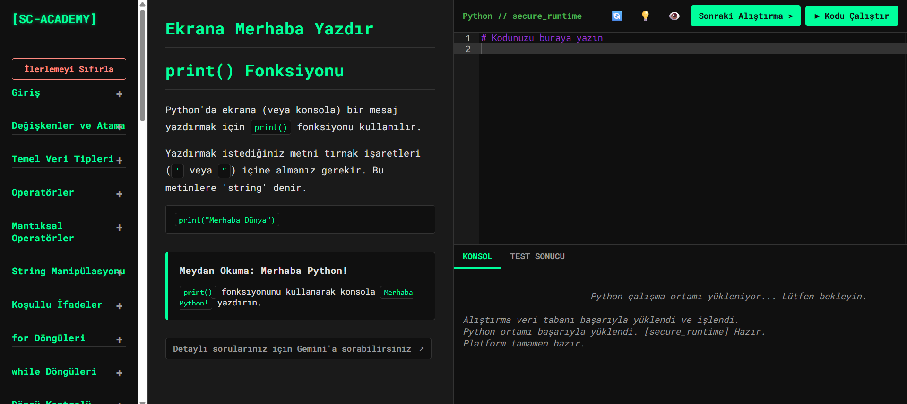

# SecureCode Platform: Siber Güvenlik için İnteraktif Python Öğrenme Ortamı

 ##  мотивация (Motivasyon)

Bu proje, siber güvenlik alanında uzmanlaşarak Türkiye'ye faydalı olma hedefim doğrultusunda, Python programlama dilini öğrenme ve pekiştirme sürecimde bana yardımcı olması amacıyla kişisel olarak geliştirilmiştir. Siber güvenlik operasyonlarında Python'un otomasyon, analiz ve araç geliştirme yeteneklerinden en iyi şekilde faydalanmak için sağlam bir temel oluşturmayı hedeflemektedir.

Proje, DataCamp, Codecademy gibi interaktif öğrenme platformlarından ilham alınarak tasarlanmış ve modern web teknolojileri kullanılarak hayata geçirilmiştir.

## ✨ Özellikler

* **İnteraktif Kod Editörü:** Ace Editor kullanılarak sözdizimi vurgulamalı, modern bir kodlama deneyimi sunar.
* **Tarayıcıda Python Çalıştırma:** Pyodide sayesinde, sunucuya ihtiyaç duymadan Python kodunu doğrudan kullanıcının tarayıcısında güvenli bir şekilde çalıştırır. Bu, özellikle kod yürütme ortamlarının güvenliği (sandboxing) açısından önemlidir.
* **Dinamik Ders İçeriği:** Dersler ve alıştırmalar harici bir `database.json` dosyasından dinamik olarak yüklenir, içeriğin kolayca genişletilmesine olanak tanır.
* **Sarmal Öğrenme Yapısı:** Sol menüde konulara göre gruplandırılmış, adım adım ilerleyen bir ders akışı sunar.
* **Anlık Geri Bildirim:** Kullanıcının yazdığı kodun çıktısı ile beklenen çözümün çıktısı karşılaştırılarak anında doğru/yanlış geri bildirimi verilir.
* **İlerleme Takibi:** Tamamlanan alıştırmalar tarayıcının `localStorage` hafızasında saklanır ve menüde `✓` işaretiyle gösterilir. İlerleme sıfırlanabilir.
* **Yardımcı Butonlar:** "İpucu Göster", "Cevabı Göster" ve "Kodu Sıfırla" gibi butonlarla öğrenme sürecini destekler.
* **Tema Seçimi:** Açık ve koyu tema seçenekleri sunar ve kullanıcının tercihini hatırlar.
* **Klavye Kısayolu:** `Ctrl+Enter` (veya `Cmd+Enter`) ile kodu hızlıca çalıştırma imkanı sunar.
* **Ayrılmış Konsol/Test Çıktısı:** Kodun çıktısı ile platformun test sonucunu ayrı sekmelerde göstererek netlik sağlar.
* **Harici Kaynak Bağlantısı:** Takılan kullanıcılar için Gemini'a yönlendirme içerir.

## 🚀 Teknolojiler

* **Ön Yüz (Frontend):** HTML5, CSS3, JavaScript (ES6+)
* **Kod Editörü:** Ace Editor
* **Python Yürütme Motoru (Tarayıcıda):** Pyodide (WebAssembly)
* **Veri Formatı:** JSON

## 💻 Nasıl Kullanılır?

1.  Bu repoyu klonlayın veya indirin.
2.  `index.html` dosyasını modern bir web tarayıcısında (Chrome, Firefox, Edge) açın.
3.  Platform kullanıma hazırdır. Herhangi bir sunucu kurulumu veya bağımlılık yüklemesi **gerekmez**.

## 🎯 Öğrenme Hedefleri ve Siber Güvenlik Bağlantısı

Bu projeyi geliştirirken hedeflenen kazanımlar:

* **Python Temelleri:** Değişkenler, veri tipleri, kontrol akışı, fonksiyonlar, OOP gibi temel Python konularını pratik alıştırmalarla pekiştirmek.
* **Web Teknolojileri:** Modern HTML, CSS ve JavaScript kullanarak dinamik bir web arayüzü oluşturmak.
* **WebAssembly (Pyodide):** Python kodunu tarayıcı ortamında güvenli bir şekilde çalıştırma konseptini anlamak.
* **Güvenlik Farkındalığı:** Özellikle kullanıcıdan alınan kodun çalıştırılmasıyla ilgili potansiyel güvenlik risklerini (RCE gibi) ve `sandboxing` (Pyodide kullanımı) gibi çözümleri kavramak.
* **API Etkileşimi:** (Gelecekte eklenebilecek özelliklerle) `requests` gibi kütüphanelerle API'lerden veri çekme ve işleme.
* **Veri İşleme:** `json`, `datetime`, `re` (Regular Expressions) gibi siber güvenlik analizlerinde sıkça kullanılan modülleri pratik etmek.

## 🛠️ Gelecek Planları (İsteğe Bağlı)

* Veritabanını daha fazla siber güvenlik odaklı (örn: `hashlib`, `socket` temelleri, `scapy` ile paket analizi simülasyonları) alıştırmalarla genişletmek.
* Kullanıcı ilerlemesini daha detaylı takip edebilmek için basit bir backend (örn: Flask/Django veya Cloudflare Workers) entegrasyonu.
* Kod kalitesini ve doğruluğunu otomatik kontrol için birim testi (unit test) entegrasyonu.

## 👤 Hakkımda

Ben Emir Sakın, Ege Üniversitesi'nde Siber Güvenlik Analistliği ve Operatörlüğü önlisans programında öğrenim görmekteyim. Siber güvenlik alanında uzmanlaşarak ülkeme katkıda bulunmayı hedefliyorum. Bu proje, bu hedefe ulaşma yolunda Python ve web teknolojileri becerilerimi geliştirmek amacıyla Yapay Zeka(GEMINI) yardımıyla yaptığım bir çalışmadır.

* **LinkedIn:** [www.linkedin.com/in/mes-41c](www.linkedin.com/in/mes-41c)
* **GitHub:** [github.com/mes41c](https://github.com/mes41c)

## 📄 Lisans

Bu proje MIT Lisansı altında lisanslanmıştır. Detaylar için `LICENSE` dosyasına bakınız.
